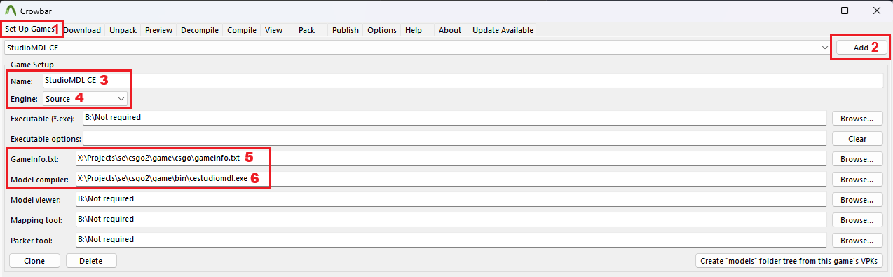

# StudioMDL-CE
###### A community-maintained StudioMDL fork focused on fixing long-standing issues, extending limits, and improving workflows, based on the CS:GO Partner Branch.

> **Note:**  
> StudioMDL-CE is currently well-tested and recommended for **Source Filmmaker** and **Garry’s Mod**.  
> Support for additional Source Engine games and branches is planned for future releases.

## Main Changes
- Improved compile time.
- Compiler is no longer tied to `bin` folder, it can be unpacked/used anywhere else
- `-game` is no longer required; if not specified (or if `gameinfo.txt` is not found), models are compiled next to the QC file by default.
- Memory usage has been optimized, improving performance and reducing memory footprint. In most cases, x86 builds should now be enough (x64 can still be used when x86 memory limits are exceeded).
- **x64 Support.** (Experimental)
- **SMD parsing is now 10 times faster.**
- **Support for using features from `$model` (flexes, eyes, etc.) in `$BodyGroup/$Body` for more flexibility.** (Experimental)

- **References (Models) can now exceed the global vertex limit (e.g. 65536) without being segmented/clamped.** Only material submeshes that exceed `$MaxVerts` are clamped or split. (Use `-UseLegacyClampMethod/$UseLegacyClampMethod` to revert old behavior)
- **Segmented/clamped models are now linked to their original bodygroups. When switching models within a bodygroup, the corresponding segmented/clamped references switch in sync and behave identically to the original model.**
- **Now is possible compile more complex models without worrying about any geometry limitations by remove limits in this direction.** (No more `Too many unified vertices` errors, [Example](https://steamcommunity.com/sharedfiles/filedetails/?id=3624270339), x64 was used)
- Large addresses are allowed (LARGEADDRESSAWARE) so that more complex models can be compiled **(e.g. a model with 1 million vertices)**. *(is valid for x86, x64 has no limits)*
- **Removed limits for flex keys, flex controllers, flex rules, and flexes in general (65536~ flex verts in total are still a limitation of the engine. Compiler allows compiling such a model, but try to avoid large numbers of flex verts to ensure correct behavior without errors and crashes in the engine)**
- Increased flex rules operations from **512** to **2048**.
- Allow increase flexes by 10 times or by specified.
- Weights threshload changed from **0.05** to **0.001**.
- Removed limits for Jiggle bones.
- **Allow `$scale` scaling vertex animations, eyes, procedural bones, attachments & etc.** (Experimental)
- No limits for writing VVD/VTX buffers.
- Added manual MDL/ANI output buffer size control (default: `64 MB`). Use `-OutputBufferSize/$OutputBufferSize` (shared) or `-MDLOutputBufferSize/$MDLOutputBufferSize`/`-ANIOutputBufferSize/$ANIOutputBufferSize` (per-file type). (Temporary solution, will be replaced by auto sizing in the near future)
- Improved compilation time when generating indices (re-sorting) by replace **nvtristrip** to **meshoptimizer** (nvtristrip can be reuse by using `-UseLegacyStripify/$UseLegacyStripify` commands).
- Flex processing behavior (primarily DMX) has been copied from SFM StudioMDL.

### Special thanks to `Red Menace` and `Smug Bastard` for investigating DMX's flex issues and some compiler issues, this has allowed me to make some improvements in this direction!
##### [Full Changelog](./changelog.md)
##### To find out how to use some commands and new features, check out this [document](./how-to-use-new-commands.md)

## Download
###### [Preview Build (Recommended)](./../../archive/refs/heads/main.zip) - Latest development build with the newest features and fixes. (Currently more stable than the last tagged release)
###### [Latest Release (0.2 – Unstable)](./../../releases/tag/0.2) - Last tagged release build with less features and fixes.

## Installation and Usage
Download the **Preview Build (Recommended)** using the link above,  
or click the green **Code** button on GitHub and select **Download ZIP**.

After downloading the archive (`StudioMDL-CE-main.zip`), choose **one of the installation methods below**.

---

### Option 1 - Install into SFM or any Source Engine game
(This method does not replace original engine files, so nothing will break.)
1. Open the downloaded archive (`StudioMDL-CE-main.zip`)
2. Navigate to the **game's root (parent) directory** (e.g. `SourceFilmmaker/game`)
3. Install the compiler in **one of the following ways**:
   - **Recommended:** Extract the **entire `bin` folder** from the archive into the game's root directory (e.g. `SourceFilmmaker/game`, this is the simplest and safest option)
   - **Alternative:** Extract the **contents of the archive's `bin` folder** into the game's existing `bin` directory  
Note: It is easier and less error-prone to copy the `bin` folder itself rather than its contents.

---

### Option 2 - Install anywhere (Advanced / Portable)
Useful if a standalone compiler or multiple versions are needed.
1. Open the downloaded archive (`StudioMDL-CE-main.zip`)
2. Choose any directory (e.g. `X:/tools/studiomdl_ce`)
3. Extract the `bin` folder (or its contents) into that directory (Will later need to manually specify the tools (e.g. Crowbar) to this location)

---

### Using StudioMDL-CE with Crowbar
1. Go to the **Set Up Games** tab
2. Click **Add** to create a new entry
3. Set **Name** to anything you like (e.g. `StudioMDL CE`)
4. Set **Engine** to `Source`
5. Set **Gameinfo.txt** path to `gameinfo.txt` (e.g. `X:/Source/SourceFilmmaker/game/usermod/gameinfo.txt`)
6. Set **Model Compiler** path to the compiler executable
	- **x86:** `bin/cestudiomdl.exe` (e.q. `X:/Source/SourceFilmmaker/game/bin/cestudiomdl.exe`)
	- **x64:** `bin/x64/cestudiomdl.exe` (e.q. `X:/Source/SourceFilmmaker/game/bin/x64/cestudiomdl.exe`)
   
	May create **two separate entries** (one for x86 and one for x64) if want to easily switch between them.

Done!
You can now select **StudioMDL CE** in Crowbar's **Compile** tab.

---

### Notes for Experienced Users
- The compiler can be used directly from the command line (or via batch files located in the `bin` folder)
- Can be integrated with **Notepad++ (NppExec)** or any custom build environment
- Nothing prevents using both x86 and x64 versions side-by-side
---

**General recommendation:**
- Use **x86** for most cases
- Use **x64** when:
	- x86 fails with `***OUT OF MEMORY***`
	- compiling very large or complex models
	- additional memory space is required

Both versions produce **visually identical results**.  
Differences are limited to minor data alignment and floating-point precision details.

---