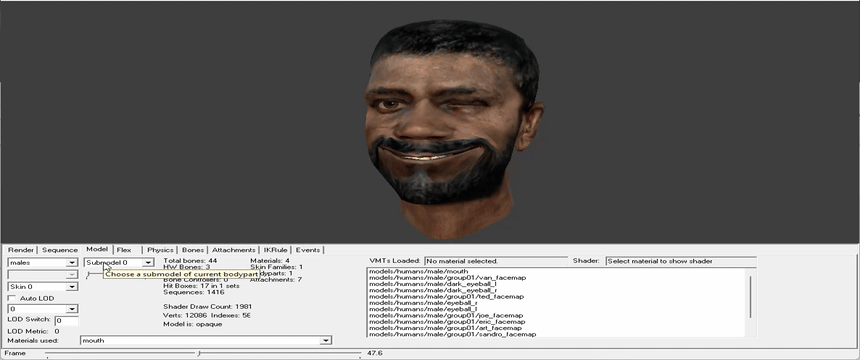

*all arguments/commands are case-insensitive*

-------------------------------------------------------------------------
## [0.3 - WIP/Preview]
-------------------------------------------------------------------------
## Additions
- **Added x64 Support** (Experimental)
- **Added Support for using features from `$model` (flexes, eyes, etc.) in `$BodyGroup/$Body` for more flexibility** (Experimental)

- **Added** `-OverrideFlexControllers/$OverrideFlexControllers` - Allows overriding existing flex controllers
- **Added** `-AllowDuplicationFlexControllers/$AllowDuplicationFlexControllers` - Allows duplicate flex controllers (USE ONLY IF KNOWING WHAT TO DO!)
- **Added** `-RemapFlexToGlobal/$RemapFlexToGlobal` - Enable remapping of flexes for the new style (DMX) to the global bone space (by default, this feature was previously enabled, but is now disabled to improve flexes quality)
- **Added** `-ComputeWrinkles/$ComputeWrinkles` - Uses the current combo rules ( i.e. The wrinkleScales, via SetWrinkleScale()) to compute wrinkle delta values.
- **Added** `-ComputeDeltaNormals/$ComputeDeltaNormals` - Computes new smooth normals for the current mesh and all of its delta states.
- **Added** `-ComputeNormalsAndWrinkles/$ComputeNormalsAndWrinkles` - Uses **-ComputeDeltaNormals/$ComputeDeltaNormals** and **-ComputeWrinkles/$ComputeWrinkles** at the same time.
- **Added** `ComputeWrinkles` - Uses the current combo rules on current model ( i.e. The wrinkleScales, via SetWrinkleScale()) to compute wrinkle delta values.
- **Added** `ComputeDeltaNormals` - Computes new smooth normals for the current model and all of its delta states.
- **Added** `ComputeNormalsAndWrinkles` - Uses **ComputeDeltaNormals** and **ComputeWrinkles** at the same time on current model
- **Added** `IgnoreComputeWrinkles` - Disable compute wrinkles on current model (if **-ComputeWrinkles/$ComputeWrinkles** is used)
- **Added** `IgnoreComputeDeltaNormals` - Disable compute delta normals on current model (if **-ComputeDeltaNormals/$ComputeDeltaNormals** is used)
- **Added** `IgnoreComputeNormalsAndWrinkles` - Disable compute delta normals and wrinkles on current model (if **-ComputeWrinkles/$ComputeWrinkles** and **-ComputeDeltaNormals/$ComputeDeltaNormals** is used)
- **Added** `-MDLOutputBufferSize/$MDLOutputBufferSize` - Maximum buffer size for writing data to MDL file (by default this buffer size is  **64 MB**)
- **Added** `-ANIOutputBufferSize/$ANIOutputBufferSize` - Maximum buffer size for writing data to ANI file (by default this buffer size is  **64 MB**)
- **Added** `-OutDir/$OutDir` - Output path where the model will eventually be compiled, either an absolute path or relative to qc.
- **Added** `-IgnoreEyeballScaling/$IgnoreEyeballScaling` - Ignores eye offsets and radius scaling when using the $scale command.

## Fixes
- **Fixed** some crashes and bugs when 17+ `$CDMaterials` appear.
- **Fixed** issues where two separate VTAs caused the compiler to crash.
- **Fixed** incorrect default flex pose for legacy VTA animations
- **Fixed** memory leaks in Vertex Animations (VTA/DMX) to fix random crashes
- **Fixed** flex issues (for the new style, i.e. DMX) after segmentation/clamping, when the compiler could crash after processing them.
- **Fixed** duplication of flex controllers after segmentation/clamping models. (Reverse engineered behavior from SFM StudioMDL)
- **Fixed** too dark delta normals when mixing more than 2~3 flexes in DMX, now the result is 1:1 as reproduced by StudioMDL from SFM
- **Fixed** regression where `$scale` did nothing to VTA vertices (now they match the model vertices)
- **Fixed** when attachments could be incorrect when using $scale (absolute, for example)
- **Fixed** when `NoAutoDMXRules` deleted all flex controllers instead of controllers from the current DMX (use `NoAutoDMXRulesLegacy` to revert old behavior if needed)
- **Fixed** MDL data prediction, now there is no random garbage when recompiling
- **Fixed** missing mesh parts during segmentation.
- **Fixed** `replacemesh` sub-command in `$LOD` (Now is works correctly because is was broken feature)

## Changes
- Improved compile time
- Compiler is no longer tied to `bin` folder, it can be unpacked/used anywhere else
- `-game` is no longer required; if not specified (or if `gameinfo.txt` is not found), models are compiled next to the QC file by default.
- Memory allocations have been changed, compiler now uses less memory, and some overall memory usage optimizations have been made.
- Compiler now warns user about `*** OUT OF MEMORY ***` if memory limit is reached.
- Renamed compiled dependencies (exe, dll) with `ce` prefix to prevent conflicts. (Some users replaced the original files with files from this project)
- **SMD parsing is now 10 times faster.**
- Improved memory usage during DMX flex parsing
- **Removed limits for flex keys, flex controllers, flex rules, and flexes in general (65536~ flex verts in total are still a limitation of the engine. Compiler allows compiling such a model, but try to avoid large numbers of flex verts to ensure correct behavior without errors and crashes in the engine)**
- Removed limits for Jiggle bones (To get rid of problems when there are many of them and the compiler starts crashing, since the optimization of the number of jingle bones occurs at the end after qc parsing)
- `$MaxVerts` is slightly modified for new method to limit the value if it exceeds the overall limit (If `-UseLegacyClampMethod/$UseLegacyClampMethod` is used, it works as before)
- **References (models) can now go beyond the global vertex limit (e.g. 65536) without being segmented/clamped.** Only material submeshes that exceed `$MaxVerts` are clamped or split. (Use `-UseLegacyClampMethod/$UseLegacyClampMethod` to revert old behavior)
- **Segmented/clamped models are now linked to their original bodygroups. When switching models within a bodygroup, the corresponding segmented/clamped models switch in sync and behave identically to the original model.**
- `$scale` is now supported on procedural bones
- Changed `$pushd` / `$cd` behavior: commands now operate globally and support includes and procedural bones (VRD). (Added `$PUSHDInclude <1|0>` and `$PUSHDProcedural <1|0>` to control this behavior)
- Improved `COptimizedModel::BuildStripsRecursive`, stack size reverted to defaults because stack overflow no longer occurs due to recursion during strip generation
- Unified processing of old-style (VTA) flexes in `RemapVertexAnimations` (For performance)

## Deletions
- **Removed** MAXSTUDIOFLEXDESC (After improving flex limits, this is not required)
- **Removed** MAXSTUDIOFLEXCTRL (After improving flex limits, this is not required)
- **Removed** MAXSTUDIOFLEXKEYS (After improving flex limits, this is not required)
- **Removed** MAXSTUDIOFLEXRULES (After improving flex limits, this is not required)
- **Removed** MAXSTUDIOSRCVERTS (After improving flex and unique verts limits, this is not required)
- **Removed** unnecessary/unused dependencies
- **Removed** `-nop4` and perforce dependencies in general - now is useless
- **Obsolete** `-VVDOutputBufferSize/$VVDOutputBufferSize`/`-VTXOutputBufferSize/$VTXOutputBufferSize` - VVD/VTX now has no limits
- **Obsolete** `-UniqueIndicesSize/$UniqueIndicesSize` - now has no limits (No more `Too many unified vertices` errors)
- **Obsolete** `-DontDestroy/$DontDestroy` - now this is useless and was a temporary "solution."

## TODO
- **TODO** Add a wiki page with command examples.
- **TODO** Support old-style (VTA) flexes after segmentation/clamping.
- **TODO** Add command to compile MDL as 47/48 version for backward compatibility. (so that the compiler can be used on other iterations of the engine)
- **TODO** Remove `$OutputBufferSize/-OutputBufferSize` and `-MDLOutputBufferSize/$MDLOutputBufferSize`/`-ANIOutputBufferSize/$ANIOutputBufferSize` to avoid the user having to worry about the output buffer size each time.
- **TODO** Remove some of the limits on the number of materials in models.
- **TODO** Improve DMX parsing speed as much as possible (Mostly KeyValue version of the format).
- **TODO** Improve (without losing performance) precision between x86 and x64 for data prediction & fix possible weird bugs with floats.
- **TODO** When comparing the same mesh using SMD and DMX, differences in normals may occur (this issue is seen in all studiomdl)
- **TODO** Sometimes when mixing flexes, too dark delta normals can occur on a few vertices (the same thing happens in StudioMDL from SFM or slightly differently). This may be due to how DMX handles normals in general when parsing deltas, unify vertices or with float precision.
- **TODO** Improve processing time for `RemapVertexAnimations` (`BuildModelToVAnimMap` isn't very effective at mapping)
- **TODO** Improve `COptimizedModel::GenerateStripGroupVerticesFromFace` -> `COptimizedModel::IsVertexFlexed` to speed up processing during VTX generation (Current attempts to boost performance are still not very effective, especially with lods)

## Known issues
- **BUG** With some models when scaling (by `$Scale`) to some larger values, may causes problems with the weights. (May be fixed, need more testing)

NOTE: If MAXSTUDIOVERTS limits are reached for any of the models (`mstudiomodel_t`) during writing, the compiler will only warn about performance, but the model will work in the engine

### Special thanks to `Red Menace` and `Smug Bastard` for investigating DMX's flex issues and some compiler issues, this has allowed me to make some improvements in this direction!

-------------------------------------------------------------------------
## [0.2 Unstable] - 27.02.25
-------------------------------------------------------------------------
## Additions
- **Added** `-DefaqScale/$DefaqScale` **(used ones)** - Increases flexes by **10** times.
- **Added** `-IgnoreDMXDefaq/$IgnoreDMXDefaq` **(used ones)** - ignore increases flexes for DMX if **$DefaqScale/-DefaqScale** is used.
- **Added** `fscale <value>` **(used within "flexfile")** - Increase flex to the specified value.
- **Added** `-OutputBufferSize/$OutputBufferSize <size in mb>` - Maximum buffer size for writing data to MDL, VVD, VTX files (by default this buffer has been increased to **64 MB**).
- **Added** `-UseLegacyStripify/$UseLegacyStripify` - Reuse nvtristrip library for generating strips (re-sorting).
- **Added** `-AlwaysCollapseByPrefix/$AlwaysCollapseByPrefix <prefix>` - Does the same thing as $alwayscollapse, only collapse bones by prefix in the name.
- **Added** `addcontrollerbyflex <type> <min> <max>` **(used within "flexfile")** - Creates flex controllers based on flexes (their name, specified type and specified minimum/maximum).
- **Added** `BindToOneBone` **(used within $bodygroup, $model, $body)** - Overrides model weights to the first bone in vertex **(Experimental)**.
- **Added** `-EyeballScale <scale>` - Equivalent to the **$EyeballScale** command.
- **Added** `-CollisionBindToOneBone/$CollisionBindToOneBone` **(used ones)** - Overrides collision model weights to the first bone in vertex **(Experimental)**.
- **Added** `-IncludeAnimPrefix/$IncludeAnimPrefix <prefix>` **(used ones)** - Adds a prefix to the end of the model's include name in $includemodel.
- **Added** `-IncludePrefix/$IncludePrefix <target> <prefix>` - Adds a prefix at the end of the file name that is specified in $include.
- **Added** `renamematbyprefix <prefix>` **(used within $bodygroup, $model, $body)** - Adds a prefix to the material name.

## Fixes
- **Fixed** cutting model into multiple references crash.
- **Fixed** crashes on indices generation due to file buffer overflow (This buffer can be configured with **$outputbuffersize/-outputbuffersize**).
- **Fixed** writing materialreplacement in file.
- **Fixed** empty "**bad command**" error with collision models.

## Changes
- Allow increase flexes by 10 times or by specified
- Increased file buffer size to **64 mb** for writing MDL, VTX, VVD.
- Improved compilation time when generating indices (re-sorting) by replace **nvtristrip** to **meshoptimizer** (nvtristrip can be reuse by using **$UseLegacyStripify/-UseLegacyStripify** commands).
- Large addresses are allowed (LARGEADDRESSAWARE) so that more complex models can be compiled **(e.g. a model with 1 million vertices)**.
- Changed logic of bones collapse, now when using **$alwayscollapse** - it will be collapsed always, even if this bone has weights on vertices.
- Slightly changed debugging information when cutting model into multiple models (Which model is in process and how many vertices it has).
- Increased flex rules operations from **512** to **2048**.
- **renamemat** now support DMX.
- It is no longer necessary to specify **$maxverts** (only if you need the wireframe for debugging, it is better to set the limit to **32768** or **21845**).

## Known issues
- **BUG** With some models when scaling (by **$scale**) to some larger values, may causes problems with the weights.
- **BUG** At the moment cutting a model into several only works with group 0 and model 0, the other groups and models may be missing some parts of the meshes!

-------------------------------------------------------------------------
## [0.1 Unstable] (Initial Release) - 12.12.24
-------------------------------------------------------------------------
## Additions
- **Added** `-DontDestroy/$DontDestroy` - Prevents deletion of processed files after a crash (Useful only at the stage of successful indices generation).
- **Added** `-IgnoreEyelid/$IgnoreEyelid` - Disables automatic eyelid setup for eyeballs while preserving flex rules.
- **Added** `-AddInvStudioFlexes/$AddInvStudioFlexes` - Generates inverted flexes and creates corresponding inverted rules by multiplying their values by -1.
- **Added** `-ZeroFlexDecay/$ZeroFlexDecay` - Removes "decay" effect between flexes. This is particularly useful in Source Filmmaker (SFM) to prevent flexes from resetting to zero during shot transitions.
- **Added** `-MostlyOpaque` - Assigns the **STUDIOHDR_FLAGS_TRANSLUCENT_TWOPASS** model flag to forcing engine process shaders in two passes. This can help resolve transparency issues or improve Ambient Occlusion (AO).
- **Added** `$AllowCollapseVertexBone` - Allows collapse vertex bones (Not collapse only if this bone is used in bonemerge, ik, animation and attachment).
- **Added** `$HBoxIgnoreChild` - Ignores compute child bboxes (may be useful for SFMs when bbox is too large).
- **Added** `$EyeballScale` - Scales eye position and pupil size based on the value ($scale will be ignored for eyes by this command).
- **Added** `$IgnoreEyeballIrisScale` - Ignores pupil scale when $scale or $EyeballScale is used. (Probably useful when using EyeRefract shader and the eye radius is set in the material)
- **Added** `$IgnoreDefaultFlexKey` - Ignore bakes defaultflex vertexes into model (lods) vertexes.
- **Added** `renamemat` **(used within $bodygroup, $model, $body)** - Creates a unique version of the model and renames the material from source to target. (Useful when we don't need to manually create a copy of the model file with a different material name)
- **Added** `invertcontrollers` **(used within "flexfile")** - Works like the `-AddInvStudioFlexes` argument. It copy original flexes & inverts them with change controller range (-1 1) until toggled off.

## Changes
- Vertex animations limit increased to **65,536** (MAXSTUDIOFLEXVERTS)
- Bones limit increased to **256** (MAXSTUDIOBONES)
- Materials limit increased to **128** (MAXSTUDIOSKINS)
- Flex controllers limit increased to **480** (MAXSTUDIOFLEXCTRL)
- Animation limit increased to **3000** (MAXSTUDIOANIMS)
- Weights threshload changed from **0.05** to **0.001**
- **$scale** now supports scaling of old-style vertex animations (including eyes)

## Known issues
- **BUG** Cutting model into multiple models cause crash.
- When writing materialreplacement in file cause crash sometimes ("fixed" by **$dontdestroy/-dontdestroy** command temporary).
- Crash on indices generation due to file buffer overflow.
- Empty **"bad command"** error with collision models.
- **BUG** With some models when scaling (by **$scale**) to some larger values, may causes problems with the weights.